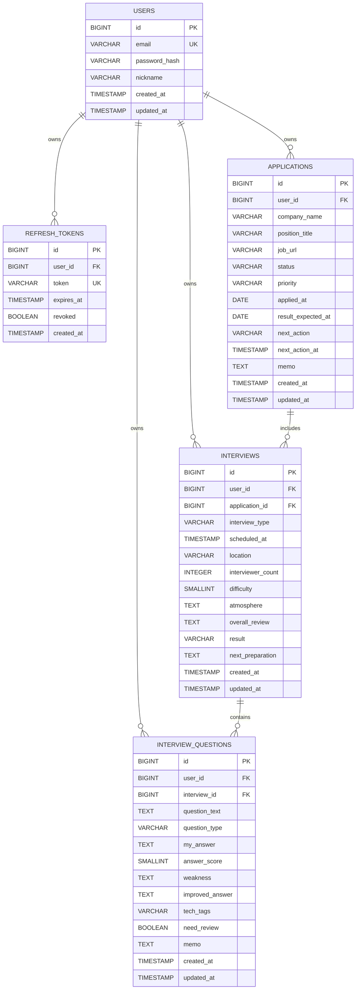

# CareerLog ERD

> CareerLog 1차 MVP 기준의 논리 ERD입니다.  
> 개발 진행에 따라 엔티티와 관계는 변경될 수 있습니다.
>
> 최종 수정일: 2026-07-19

## 1. ERD



## 2. 관계 설명

| 관계 | 카디널리티 | 설명 |
|---|---|---|
| `USERS` → `APPLICATIONS` | 1:N | 한 사용자는 여러 지원 건을 등록할 수 있습니다. |
| `USERS` → `REFRESH_TOKENS` | 1:N | 한 사용자는 여러 로그인 세션의 Refresh Token을 가질 수 있습니다. |
| `USERS` → `INTERVIEWS` | 1:N | 한 사용자는 여러 면접 기록을 소유할 수 있습니다. |
| `APPLICATIONS` → `INTERVIEWS` | 1:N | 하나의 지원 건에는 전화면접, 기술면접, 최종면접 등 여러 면접이 연결될 수 있습니다. |
| `USERS` → `INTERVIEW_QUESTIONS` | 1:N | 한 사용자는 여러 면접 질문 기록을 소유할 수 있습니다. |
| `INTERVIEWS` → `INTERVIEW_QUESTIONS` | 1:N | 하나의 면접에는 여러 질문이 포함될 수 있습니다. |

## 3. 소유권 구조

CareerLog의 모든 핵심 데이터는 사용자에게 귀속됩니다.

```text
User
└── Application
    └── Interview
        └── InterviewQuestion
```

`Interview`와 `InterviewQuestion`도 각각 `user_id`를 보유합니다. 이는 사용자별 조회와 접근 제어를 단순하게 하기 위한 설계입니다.

다만 다음 값은 항상 일치해야 합니다.

```text
interviews.user_id = applications.user_id
interview_questions.user_id = interviews.user_id
```

이 일관성은 면접과 질문을 생성할 때 서비스 계층에서 현재 로그인 사용자의 소유권을 검증하여 보장합니다.

## 4. 설계 원칙

### 4.1 회사와 공고를 초기에는 분리하지 않음

MVP에서는 빠르게 핵심 기능을 완성하기 위해 회사명과 공고 정보를 `APPLICATIONS`에 함께 저장합니다.

```text
APPLICATIONS
- company_name
- position_title
- job_url
```

동일 회사에 대한 여러 지원 기록과 공고 원문 관리가 필요해지면 `COMPANIES`, `JOB_POSTINGS`로 분리할 수 있습니다.

### 4.2 공통 시간 필드는 상속으로 관리

`USERS`, `APPLICATIONS`, `INTERVIEWS`, `INTERVIEW_QUESTIONS`의 생성일과 수정일은 `BaseTimeEntity`를 상속하여 관리합니다.

`BaseTimeEntity`는 `@MappedSuperclass`이므로 ERD에 별도 테이블로 표시하지 않습니다.

### 4.3 사용자 소유권 검증

단순히 기본 키만 사용하여 데이터를 조회하지 않습니다.

```text
applicationId + currentUser
interviewId + currentUser
questionId + currentUser
```

조회, 수정, 삭제 시 현재 로그인 사용자의 데이터인지 확인하고, 다른 사용자의 데이터에는 접근할 수 없도록 처리합니다.

### 4.4 열거형은 문자열로 저장

지원 상태, 우선순위, 면접 유형, 면접 결과와 질문 유형은 문자열로 저장합니다.

```text
ApplicationStatus → VARCHAR
Priority          → VARCHAR
InterviewType     → VARCHAR
InterviewResult   → VARCHAR
QuestionType      → VARCHAR
```

숫자 순서에 의존하지 않으므로 enum 항목의 순서가 변경되어도 기존 데이터의 의미가 유지됩니다.

## 5. 향후 확장 ERD 후보

MVP 이후 아래 엔티티를 추가할 수 있습니다.

```text
Company
JobPosting
ApplicationStatusHistory
Note
Tag
QuestionTag
```

예상 확장 관계는 다음과 같습니다.

```text
Company 1 ── N JobPosting
JobPosting 1 ── N Application
Application 1 ── N ApplicationStatusHistory
InterviewQuestion N ── M Tag
InterviewQuestion 1 ── N Note
```

이 항목들은 현재 MVP ERD에는 포함하지 않습니다.
